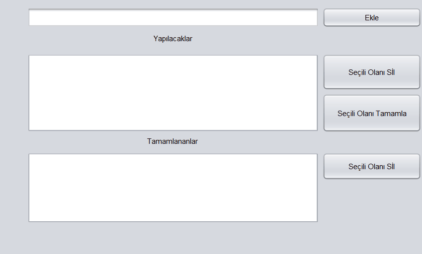
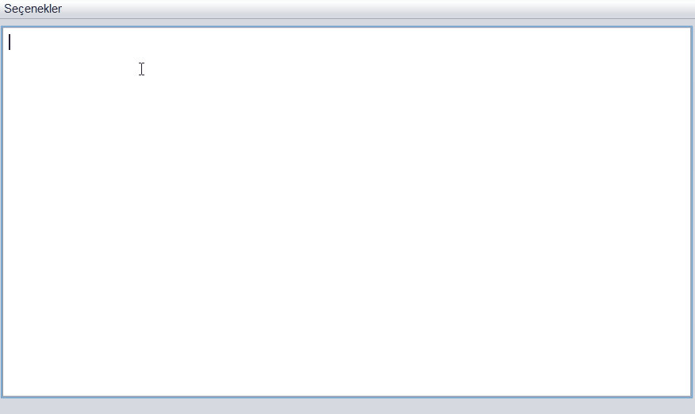
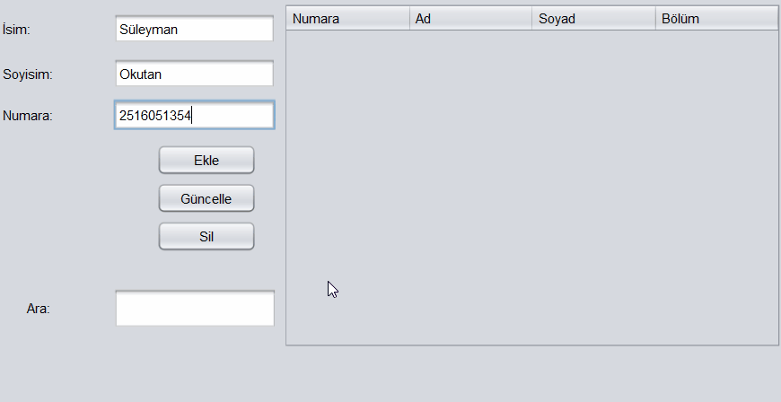
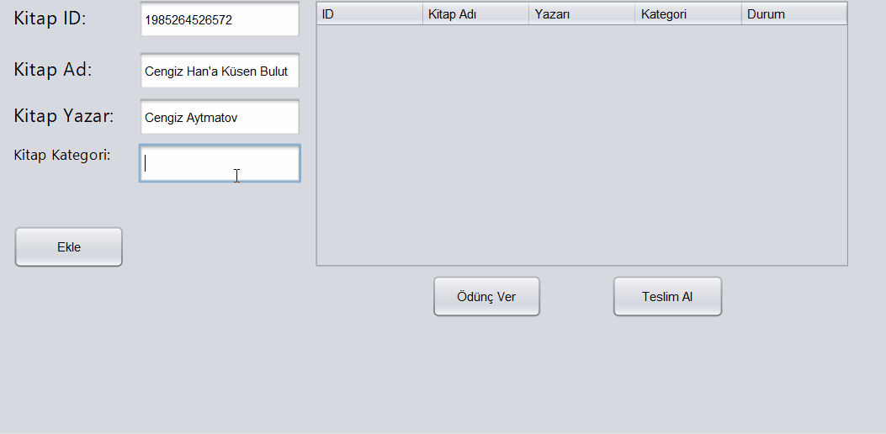
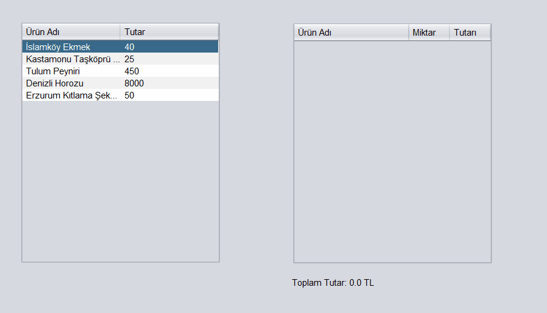
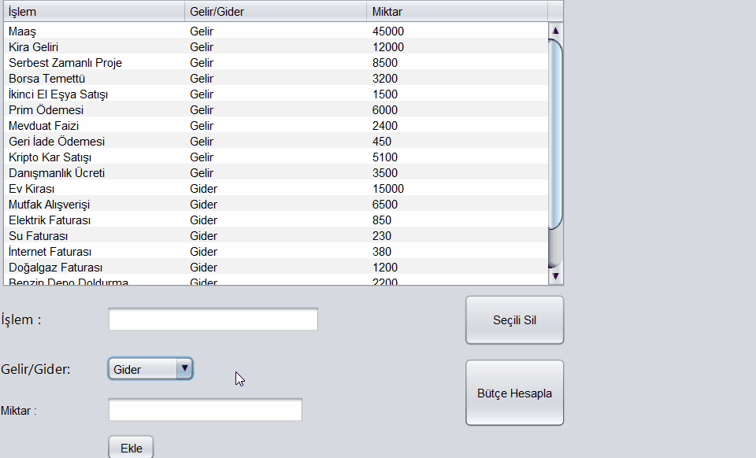
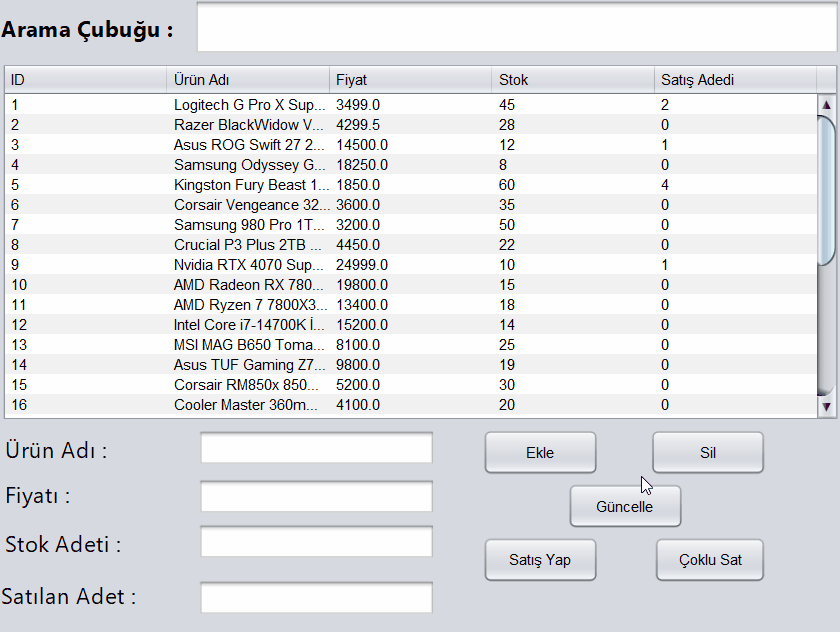

# 💻 Java Swing & SQLite Otomasyon ve Yönetim Sistemleri

Bu repository, Java Swing GUI kütüphanesi ve gömülü SQLite veritabanı mimarisi kullanılarak geliştirilmiş 10 farklı masaüstü otomasyon ve yönetim projesini içermektedir.

---

## 🚀 Proje Listesi ve Detayları

### 1. 📝 Yapılacaklar Listesi Uygulaması (`p1_yapilacaklarliste.java`)
Kullanıcıların günlük görevlerini, yapılacak işlerini ekleyip, tamamlandı olarak işaretleyebileceği veya silebileceği yapılacaklar listesi (To-Do List) uygulaması.
* **Öne Çıkan Özellikler:** Pratik görev ekleme/silme, durum takibi ve listeleme.

<p align="center">
  
</p>

---

### 2. 📓 Not Defteri Uygulaması (`p2_notdefteri.java`)
Metin düzenleme, yeni not oluşturma, var olan notları kaydetme ve yönetme işlevlerini barındıran masaüstü not defteri modülü.
* **Öne Çıkan Özellikler:** Dinamik metin alanı (`JTextArea`), not listeleme ve dosya/veri kaydetme.

<p align="center">
  
</p>

---

### 3. 🎓 Öğrenci Yönetim Sistemi (`p3_ogrencisistem.java`)
Öğrenci bilgilerini (numara, ad-soyad, bölüm, notlar) kaydetme, güncelleme ve veritabanı üzerinde sorgulama işlemlerini gerçekleştiren otomasyon.
* **Öne Çıkan Özellikler:** Öğrenci CRUD (Ekle, Oku, Güncelle, Sil) işlemleri ve tablo üzerinden veri takibi.

<p align="center">
  
</p>

---

### 4. 📚 Kütüphane Otomasyonu (`p4_kutuphanesistem.java`)
Kütüphanedeki kitapların stok durumunu, ödünç alma/teslim etme süreçlerini ve yazar/kitap bilgilerini takip eden otomasyon sistemi.
* **Öne Çıkan Özellikler:** Kitap arama, stok/ödünç durum yönetimi.

<p align="center">
  
</p>

---

### 5. 🏷️ Satış Otomasyonu (`p5_satisotomasyonu.java`)
Hızlı satış işlemleri, ürün kategorileri ve kasa takibi için geliştirilmiş perakende satış otomasyonu.
* **Öne Çıkan Özellikler:** Hızlı ürün seçimi, adisyon/fiş tutar hesabı.

<p align="center">
  
</p>

---

### 6. 🎬 Sinema Bilet Otomasyonu (`p6_sinemasistem.java`)
Film seansları, salon seçimi, koltuk düzeni ve bilet satışı süreçlerini yöneten sinema otomasyonu.
* **Öne Çıkan Özellikler:** Seans/film yönetimi, bilet kesme ve gelir takibi.

<p align="center">
  
</p>

---

### 8. 💰 Kişisel Finans Yönetim Programı (`p8_finansprogrami.java`)
Gelir-gider takibi, bütçe yönetimi ve finansal raporlamaların yapılabildiği kişisel finans uygulaması.
* **Öne Çıkan Özellikler:** Kategori bazlı gelir/gider ekleme, toplam bütçe hesabı ve veritabanı kaydı.

<p align="center">
  
</p>

---

### 9. 📑 Ders Kayıt Sistemi (`p9_derskayitsistemi.java`)
Öğrencilerin alacağı dersleri seçmesi, ders kontenjan takibi ve akademisyen/ders eşleştirmelerini sağlayan akademik kayıt otomasyonu.
* **Öne Çıkan Özellikler:** Ders seçimi, kredi/kontenjan hesabı ve öğrenci-ders ilişkisi.

<p align="center">
  
</p>

### 10. 🛒 E-Ticaret Stok ve Satış Sistemi (`p10_esatissitem.java`)
Ürün stok kontrolü, dinamik arama, çoklu adet satışı ve otomatik stok düşümü yapan e-ticaret yönetim modülü.
* **Öne Çıkan Özellikler:** Transaction tabanlı satış, stok takibi, sayısal sütun sıralama ve korumalı JTable yapısı.

<p align="center">
  
</p>

---
---

## 🛠️ Kullanılan Teknolojiler

* **Dil:** Java
* **Arayüz (GUI):** Java Swing, NetBeans GUI Builder (`JFrame`, `JTable`, `JOptionPane`)
* **Veritabanı:** SQLite (JDBC Driver entegreli)
* **Geliştirme Ortamı:** NetBeans IDE / Apache NetBeans

---

## ⚙️ Kurulum ve Çalıştırma

1. Repo'yu projelerin kurulu olduğu dizine klonlayın:
   ```bash
   git clone [https://github.com/HastroGG/Java-Swing-Automation-Projects]
